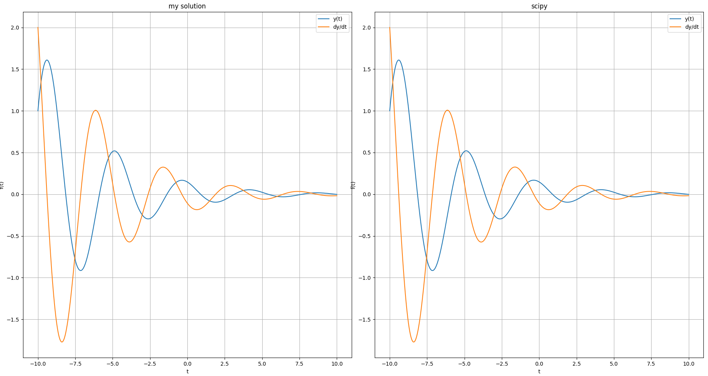
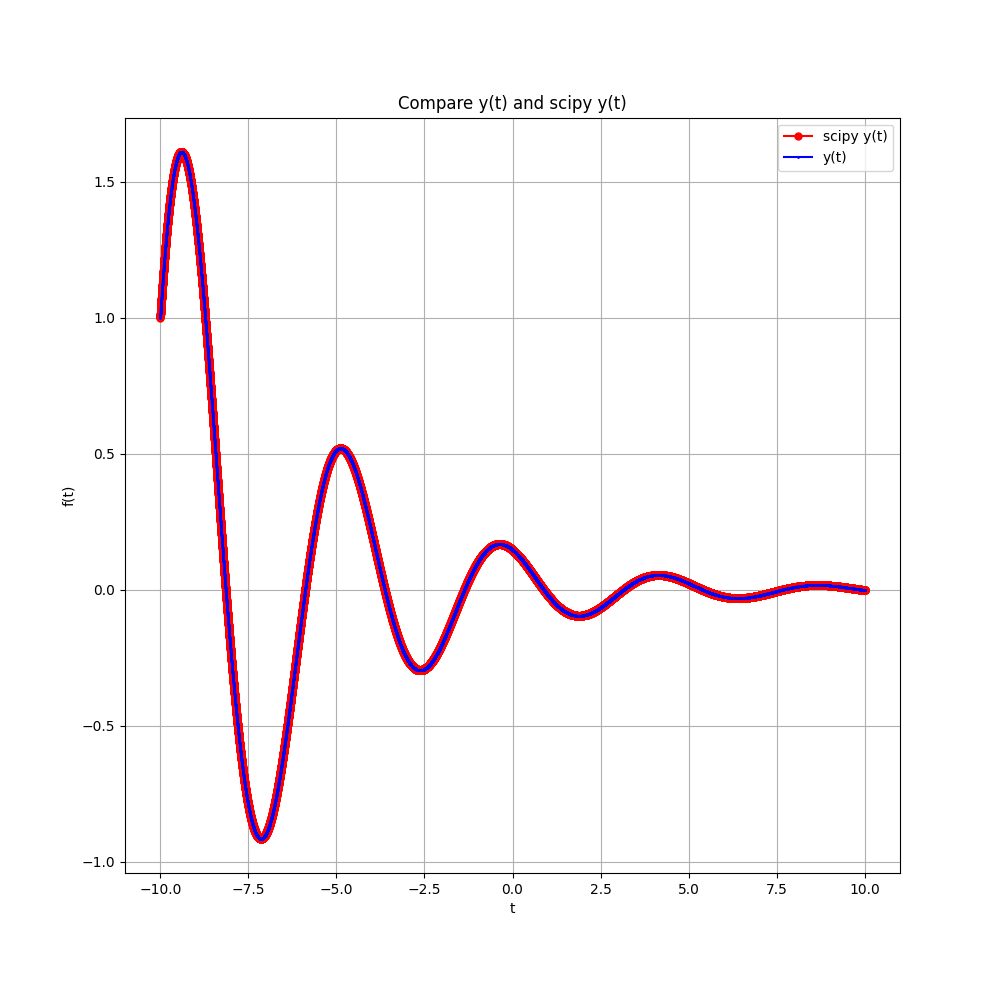
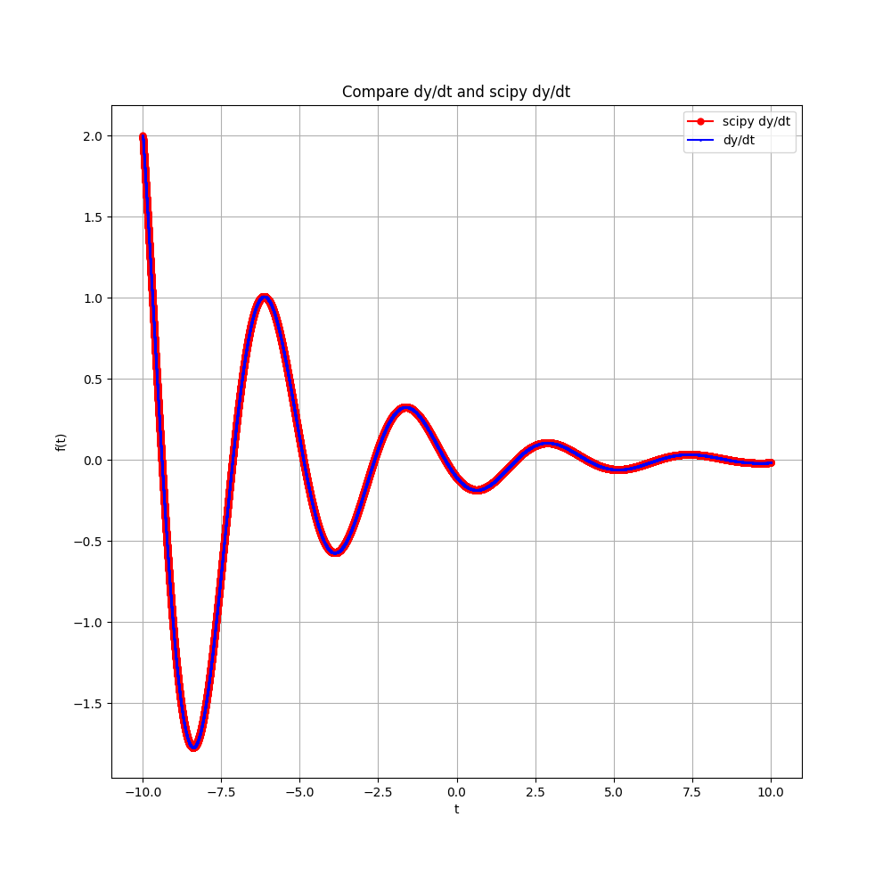

# it-modeling
### Задание
Реализовать численное интегрирование уравнения $m\ddot y+p \dot y +ky=0$ любым методом (m, p, k – заданные числовые параметры)

Преобразуем:

$$\left\{\begin{cases} \dfrac{dy}{dt}=u \\
\dfrac{du}{dt} = -\dfrac{p}{m}u - \dfrac{k}{m}y \\ \end{cases} \right.$$

Для решения использовался метод Рунге-Кутты 4-го порядка, дополнительно использовалось сравнение с решением, полученным методом библиотеки scipy.

В данном примере решение при параметрах p=1, m=2, k=4 c диапазоном t от -10 до 10, и шагом 0.001.

